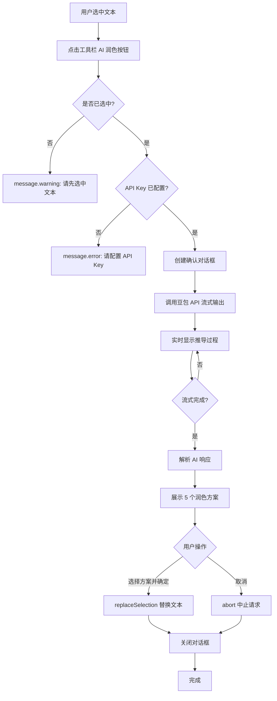
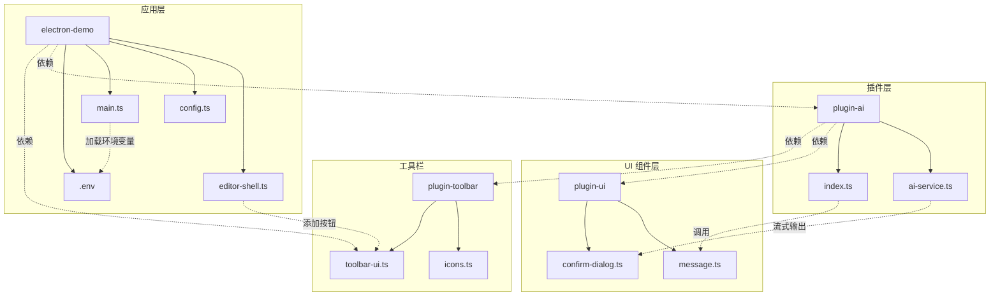

# AI 润色功能

## 功能概述

为 Nexus Editor 新增 AI 文本润色功能，用户选中文本后可调用豆包大模型进行智能优化，支持流式输出和 5 种方案选择。

## 使用流程



## 架构设计



## 核心实现思路

### 1. 插件化架构

基于项目现有的插件系统，创建独立的 `plugin-ai` 和 `plugin-ui` 插件：

- **服务层** (`ai-service.ts`)：封装 AI API 调用、流式输出处理、响应解析
- **入口层** (`index.ts`)：导出润色处理器和插件工厂
- **UI 组件层** (`plugin-ui`)：通用消息提示和确认对话框组件

### 2. 流式输出处理

使用 `ReadableStream` + `TextDecoder` 解析 SSE 格式，支持不完整行的 buffer 处理：

```typescript
buffer += decoder.decode(value, { stream: true });
const lines = buffer.split('\n');
buffer = lines.pop() || ''; // 保留未完成的行

for (const line of lines) {
  if (line.startsWith('data: ')) {
    const json = JSON.parse(jsonStr);
    const token = json.delta || '';
    if (token) handler.onToken(token);
  }
}
```

### 3. 响应解析策略

使用分隔符解析 AI 返回的结构化内容，支持多层降级：

- **主策略**：`---` 分隔推导过程和选项，`===` 分隔不同选项
- **降级策略**：JSON 解析、正则匹配（支持 `【】`、`[]`、`()` 等格式）
- **标签解析**：`【方案N】标签名称` 格式，支持 Markdown 标题前缀

### 4. 通用 UI 组件

创建独立的 `plugin-ui` 插件管理通用组件：

- **message**：支持 success/warning/error/info 四种类型，自动消失，懒加载样式（SSR 兼容）
- **confirm-dialog**：支持流式输出展示、5 选项单选、推导过程小字号灰色显示

### 5. 工具栏扩展

通过 `additionalGroups` 选项在不修改默认按钮组的情况下添加 AI 按钮：

```typescript
const aiGroup: ToolbarGroup = {
  buttons: [{
    id: "ai-polish",
    title: "AI 润色",
    icon: () => iconAI(),
    action: (editor) => aiPolishHandler(editor, AI_CONFIG),
  }],
};

const toolbar = createToolbarUI(editor, { additionalGroups: [aiGroup] });
```

## 配置说明

### 环境变量配置

1. 复制 `.env.example` 为 `.env`：
```bash
cp apps/electron-demo/.env.example apps/electron-demo/.env
```

2. 填入你的 API Key：
```env
NEXUS_AI_API_KEY=ark-xxxxxxxxxxxxxxxxxxxxxxxxxxxxxxxx
```

### 主进程加载

Electron 主进程通过 `dotenv` 加载 `.env` 文件：

```typescript
// electron/main.ts
import dotenv from "dotenv";
dotenv.config({ path: path.resolve(__dirname, "../.env") });
```

### 默认配置

```typescript
// apps/electron-demo/src/renderer/config.ts
export const DEFAULT_AI_CONFIG: AIConfig = {
  apiKey: "", // 通过环境变量 NEXUS_AI_API_KEY 配置
  provider: "doubao",
  model: "doubao-seed-2-0-lite-260428",
};
```

## AI Prompt 设计

```
优化文本：{text}

请严格按照以下格式输出：
你的优化思路和分析过程

---

【方案1】标签名称
优化后的文本内容

===

【方案2】标签名称
优化后的文本内容

===

【方案3】标签名称
优化后的文本内容

===

【方案4】标签名称
优化后的文本内容

===

【方案5】标签名称
优化后的文本内容

要求：
1. 要求说明优化思路
2. 使用 --- 分隔思考和方案
3. 使用 === 分隔不同方案
4. 每个方案的标签用【】包含
5. 提供5种不同风格的优化版本
6. 保持原意不变，语言更流畅自然
7. 不要输出任何多余内容
8. 【方案N】和标签名称必须在同一行，不要换行
```

## 安全配置

### Content Security Policy

```html
<meta http-equiv="Content-Security-Policy"
  content="default-src 'self'; ... connect-src 'self' https://ark.cn-beijing.volces.com" />
```

限制 `connect-src` 仅允许豆包 API 域名，防止数据泄露。

### Electron IPC 安全

通过预加载脚本暴露 `getEnv` 方法，避免渲染进程直接访问 `process.env`：

```typescript
// preload.ts
contextBridge.exposeInMainWorld("nexusDemo", {
  getEnv: (key: string) => ipcRenderer.invoke("demo:get-env", key)
});
```

### API Key 前置校验

在调用 API 前检查 API Key 是否已配置：

```typescript
if (!config.apiKey) {
  message.error("请先配置 AI API Key");
  return false;
}
```

## 文件变更清单

### 新增文件

| 文件 | 说明 |
|------|------|
| `packages/plugin-ai/package.json` | AI 插件配置 |
| `packages/plugin-ai/src/ai-service.ts` | AI 服务层（流式输出、响应解析） |
| `packages/plugin-ai/src/index.ts` | AI 插件入口 |
| `packages/plugin-ai/test/ai-service.test.ts` | AI 服务层单元测试 |
| `packages/plugin-ui/package.json` | UI 组件库配置 |
| `packages/plugin-ui/src/message.ts` | 消息提示组件 |
| `packages/plugin-ui/src/confirm-dialog.ts` | 确认对话框组件 |
| `packages/plugin-ui/src/index.ts` | UI 组件库入口 |
| `packages/plugin-ui/test/message.test.ts` | 消息组件单元测试 |
| `apps/electron-demo/src/renderer/config.ts` | AI 配置常量 |
| `apps/electron-demo/.env.example` | 环境变量示例文件 |

### 修改文件

| 文件 | 变更说明 |
|------|----------|
| `packages/plugin-toolbar/src/icons.ts` | 新增 AI 图标 |
| `packages/plugin-toolbar/src/index.ts` | 导出 AI 图标 |
| `packages/plugin-toolbar/src/toolbar-ui.ts` | 支持 `additionalGroups` 选项 |
| `apps/electron-demo/src/renderer/editor-shell.ts` | 集成 AI 按钮和配置加载 |
| `apps/electron-demo/src/renderer/index.html` | CSP 配置（限制 connect-src） |
| `apps/electron-demo/electron/main.ts` | 添加 dotenv 加载和 IPC 处理器 |
| `apps/electron-demo/electron/preload.ts` | 暴露 `getEnv` 方法 |
| `apps/electron-demo/src/renderer/bridge.d.ts` | 类型声明 |
| `apps/electron-demo/vite.config.ts` | 路径别名配置 |
| `apps/electron-demo/package.json` | 添加 dotenv 依赖 |

## 使用示例

### 使用方式：工具栏按钮

1. 选中文本
2. 点击工具栏 "AI 润色" 按钮
3. 等待 AI 生成方案（流式展示推导过程）
4. 选择满意的方案并点击"确定"

## 错误处理

| 场景 | 处理方式 |
|------|----------|
| 未选中文本 | `message.warning("请先选中要润色的文本")` |
| 未配置 API Key | `message.error("请先配置 AI API Key")` |
| 网络请求失败 | `message.error("润色失败: {error}")` |
| 用户取消 | 中止请求，关闭对话框 |

## 单元测试

```bash
# 测试 plugin-ai
pnpm --filter @floatboat/nexus-plugin-ai test

# 测试 plugin-ui
pnpm --filter @floatboat/nexus-plugin-ui test
```

覆盖场景：
- ✅ 标准分隔符格式解析
- ✅ 5 个选项解析
- ✅ 无分隔符降级处理
- ✅ JSON 格式响应
- ✅ Markdown 标题格式
- ✅ 消息组件导出和创建

## 后续优化方向

- [ ] 支持自定义 Prompt 模板
- [ ] 支持多模型切换（GPT、Claude 等）
- [ ] 添加历史记录功能
- [ ] 支持批量润色
- [ ] 添加加载动画优化
