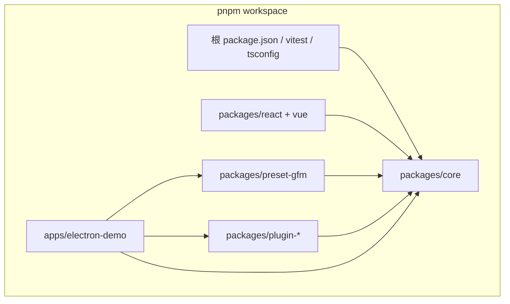
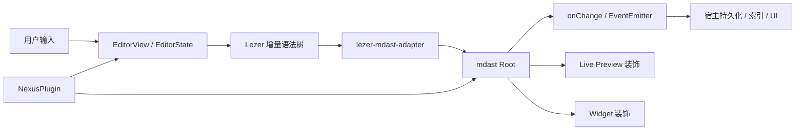
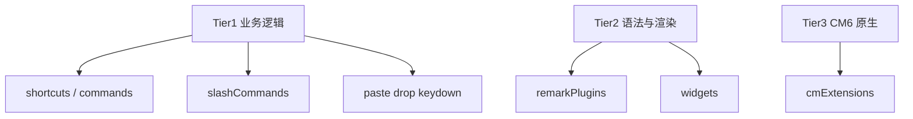
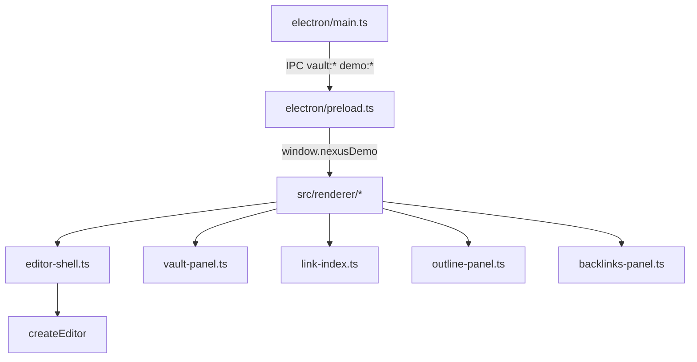
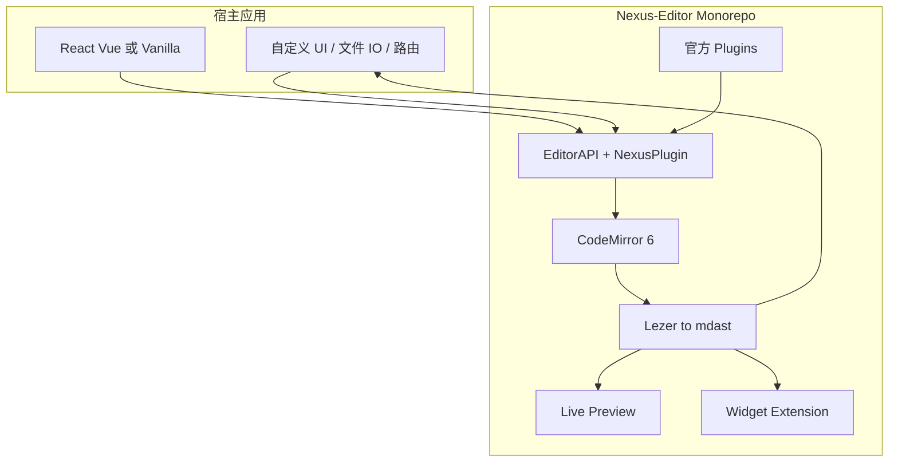

# Nexus-Editor 仓库架构详解

[English](./ARCHITECTURE.md)

---

## 1. 项目定位与设计哲学

**Nexus-Editor** 是一个 **Headless（无头）、AST 驱动、Markdown 文本为唯一真相源** 的编辑器引擎，面向笔记应用、文档 CMS、静态站点编辑器、PKM 工具和 LLM 写作助手等场景。

核心设计原则（见 [prd.md](../prd.md)、[README.md](../README.md)）：

| 原则 | 含义 |
|------|------|
| Headless | 核心只提供逻辑与 CM6 挂载点，不含强绑定 UI；样式由宿主（Tailwind 等）控制 |
| Markdown 为真相源 | 文档是 `.md` 字符串，不是 ProseMirror/Lexical 的 JSON 树；往返不丢格式 |
| AST 驱动 | 每次编辑维护 **mdast** 语法树，供 TOC、链接索引、Live Preview、插件扩展使用 |
| Local-First | 提供 `onAssetUpload`、`setDocument({ silent })`、防抖 `onChange` 等桌面/文件 IO 友好钩子 |
| 框架无关 | 核心 + React/Vue 薄绑定 + Electron 原生 demo，同一引擎多宿主 |

与 Tiptap/Lexical/Milkdown 的本质差异：**不维护独立文档模型**，Markdown 字符串即文档；与 @uiw/react-md-editor 的差异：**Obsidian 式行内 Live Preview** + 三层插件 + Widget API。

---

## 2. 仓库整体结构

**工作区配置**：[pnpm-workspace.yaml](../pnpm-workspace.yaml) 包含 `packages/*` 与 `apps/*`。

**构建与测试**：

- 各包用 **tsup** 输出 `dist/index.js` + 类型声明
- 根脚本：`pnpm build`（顺序构建 10 个包）、`pnpm test`（Vitest）、`pnpm dev:electron-demo`
- 路径别名统一在 [tsconfig.base.json](../tsconfig.base.json) 与 [vitest.config.ts](../vitest.config.ts)

**规范驱动开发**：[openspec/](../openspec/) 存放变更提案（`changes/`）与能力规格（`specs/`），重大功能需走 OpenSpec 流程（见 [openspec/AGENTS.md](../openspec/AGENTS.md)）。

---

## 3. 核心架构：数据流与分层

### 3.1 端到端数据流

**关键设计决策**（实现于 [packages/core/src/editor.ts](../packages/core/src/editor.ts)）：

1. **热路径 AST**：Lezer（CM6 内置增量解析）→ `lezerTreeToMdast()` → mdast，**同步、无 Worker 往返**，保证打字与 Live Preview 响应
2. **Remark 辅助路径**：用于 Widget 解析、`exportHTML()`、以及 `plugin.remarkPlugins` 对 mdast 的 transform（非全量重解析）
3. **双装饰系统**：
   - **Live Preview**（内置）：光标离开节点时隐藏 Markdown 语法、渲染 HTML/Widget
   - **Widget API**（插件）：基于 remark 解析 + `WidgetDefinition`，用于数学、自定义块等

### 3.2 `createEditor` 生命周期

入口：[packages/core/src/editor.ts](../packages/core/src/editor.ts) 的 `createEditor(config)` → 返回 [EditorAPI](../packages/core/src/types.ts)。

| 阶段 | 行为 |
|------|------|
| 初始化 | 合并 `plugins`、解析 locale/theme、计算初始 `currentAst` |
| 组装 CM6 扩展 | 语言包、Live Preview、Widget、keymap、fold、autopair、wikilinks、各插件 `cmExtensions` |
| 挂载 | `EditorView` 挂到 `config.container` |
| 更新 | `updateListener` 驱动 debounced `change`、selection/slash 事件；IME 合成期间延迟 `setDocument` |
| 销毁 | 清 timer、`emitter.clear()`、`view.destroy()` |

**EditorAPI 主要能力**：`getDocument` / `getAst` / `setDocument` / `exportHTML` / `getTableOfContents` / 命令与快捷键 / 事件订阅 / `getCoordsAtPos`（浮动 UI 定位）/ `getPosAtDOM`（Live Preview widget 实时位置）。

---

## 4. 核心包 `@floatboat/nexus-core` 模块地图

路径：[packages/core/src/](../packages/core/src/)

### 4.1 编排层

| 文件 | 职责 |
|------|------|
| [editor.ts](../packages/core/src/editor.ts) | 工厂函数、EditorAPI、扩展栈组装、变更/IME/slash 调度 |
| [types.ts](../packages/core/src/types.ts) | 全部公共类型：`EditorConfig`、`NexusPlugin`、`WidgetDefinition`、`LivePreviewConfig` 等 |
| [event-emitter.ts](../packages/core/src/event-emitter.ts) | 类型安全的 `on` / `off` 发布订阅 |

### 4.2 AST 管道（Lezer ↔ mdast）

| 文件 | 职责 |
|------|------|
| [lezer-markdown.ts](../packages/core/src/lezer-markdown.ts) | CM6 Markdown 语言支持（GFM + 脚注） |
| [lezer-footnote-extension.ts](../packages/core/src/lezer-footnote-extension.ts) | `[^id]` 脚注 Lezer 节点 |
| [lezer-mdast-adapter.ts](../packages/core/src/lezer-mdast-adapter.ts) | **热路径**：Lezer 树 → mdast（带 position） |
| [lezer-helpers.ts](../packages/core/src/lezer-helpers.ts) | Lezer 节点工具函数 |

### 4.3 Live Preview 子系统（Obsidian 风格）

核心逻辑：[live-preview.ts](../packages/core/src/live-preview.ts)

**行为**：光标在节点内 → 显示原始 Markdown；光标离开或不在同行 → 用 Decoration 替换为渲染结果。

| 文件 | 职责 |
|------|------|
| [live-preview-ranges.ts](../packages/core/src/live-preview-ranges.ts) | 从 mdast 收集需预览的文档区间 |
| [live-preview-renderers.ts](../packages/core/src/live-preview-renderers.ts) | 各节点类型默认 HTML 渲染 |
| [live-preview-highlight.ts](../packages/core/src/live-preview-highlight.ts) | 围栏代码块 highlight.js 高亮 |
| [live-preview-table.ts](../packages/core/src/live-preview-table.ts) | **可交互表格**（编辑、选区、列/行拖拽重排） |
| [live-preview-diag.ts](../packages/core/src/live-preview-diag.ts) | 调试诊断 |

**StateField 优化**（见 [AGENTS.md](../AGENTS.md) 表格规则）：

- 仅 selection 变化时复用 AST，只重算光标相关装饰
- 表格编辑期间 `isTableEditing()` 阻止 DOM 重建
- IME 合成期间 map 装饰，结束后重建

### 4.4 Widget 扩展（插件级自定义块）

| 文件 | 职责 |
|------|------|
| [widget-extension.ts](../packages/core/src/widget-extension.ts) | remark 解析 + `Decoration.replace` + `NexusWidget` |

与 Live Preview 的区别：Widget 走 remark 解析；匹配 `NexusPlugin.widgets`；适合 KaTeX、自定义 diagram 等。

### 4.5 编辑体验增强

| 文件 | 职责 |
|------|------|
| [markdown-keymap.ts](../packages/core/src/markdown-keymap.ts) | Markdown 感知的 Enter/Backspace |
| [markdown-autopair.ts](../packages/core/src/markdown-autopair.ts) | 括号/标记自动配对 |
| [markdown-fold.ts](../packages/core/src/markdown-fold.ts) | 标题/列表折叠 |
| [slash-state.ts](../packages/core/src/slash-state.ts) | `/` 命令检测、过滤、排序 |
| [wikilinks.ts](../packages/core/src/wikilinks.ts) | `[[wikilink]]` 扩展 + `scanWikiLinks` 索引扫描 |
| [theme.ts](../packages/core/src/theme.ts) | `NexusTheme` → CM6 主题扩展 |
| [locale.ts](../packages/core/src/locale.ts) | 中英文 UI 文案（表格标签等） |

### 4.6 事件系统

[EditorEventMap](../packages/core/src/types.ts) 定义：

- `change(doc, ast)` — 用户编辑（debounced）；`setDocument({ silent: true })` 不触发
- `focus` / `blur`
- `selectionChange({ anchor, head })`
- `slashMenuChange(SlashMenuState)` — 含 query、commands、屏幕坐标

插件还可注册 DOM 级 `handlers`：`paste` / `drop` / `keydown`，通过 `EditorEventContext` 提供 `insertMarkdown`、`uploadAsset`。

---

## 5. 三层插件体系

定义：[NexusPlugin](../packages/core/src/types.ts)

| 层级 | 字段 | 典型用途 | 示例包 |
|------|------|----------|--------|
| Tier 1 | `shortcuts`, `commands`, `slashCommands`, `handlers` | 快捷键、斜杠菜单、命令面板、粘贴拦截 | plugin-toolbar, plugin-slash |
| Tier 2 | `remarkPlugins`, `widgets` | 扩展语法、自定义块渲染 | preset-gfm, plugin-math |
| Tier 3 | `cmExtensions` | 直接注入 CodeMirror 扩展 | plugin-history, plugin-vim, plugin-search |

`createEditor` 在初始化时 **flatMap 合并** 所有插件贡献，注入单一 `EditorState` 扩展栈。

---

## 6. 各 npm 包功能说明

### 框架绑定层

| 包 | 路径 | 职责 |
|----|------|------|
| `@floatboat/nexus-react` | [packages/react/](../packages/react/) | `useEditor` + `<Editor />`：生命周期封装 `createEditor`，容器属性透传，`onReady` 回调 |
| `@floatboat/nexus-vue` | [packages/vue/](../packages/vue/) | Vue 3 composable + 组件，语义与 React 一致 |

两者均为 **薄适配层**：`UseEditorConfig = Omit<EditorConfig, "container"> & { onReady? }`。ref 挂载后创建 editor，卸载时销毁。`<Editor />` 将 `class` / `style` / `data-*` 等容器属性落到 wrapper `div`；editor 配置项（`plugins`、`onChange` 等）不会泄漏到 DOM。

### 预设

| 包 | 职责 |
|----|------|
| `@floatboat/nexus-preset-gfm` | [packages/preset-gfm/src/index.ts](../packages/preset-gfm/src/index.ts) — `createGfmPreset()` 注入 `remark-gfm`（表格、删除线、任务列表等） |

### 官方插件

| 包 | 职责 | 主要导出 |
|----|------|----------|
| `@floatboat/nexus-plugin-history` | 撤销/重做 | `createHistoryPlugin()` — `@codemirror/commands` history |
| `@floatboat/nexus-plugin-search` | 编辑器内查找替换 + 纯文本搜索辅助 | `createSearchPlugin`, `findSearchMatches`, `replaceAllMatches` |
| `@floatboat/nexus-plugin-slash` | 斜杠命令插件 + 浮动菜单 DOM | `createSlashPlugin`, `createSlashMenuUI` |
| `@floatboat/nexus-plugin-toolbar` | 格式化命令、快捷键、斜杠项、颜色装饰、工具栏 UI | `createToolbarPlugin`, `createToolbarUI`, `toggleBold` 等 |
| `@floatboat/nexus-plugin-math` | KaTeX 行内/块级数学 | `createMathPlugin()` — `remark-math` + widgets |
| `@floatboat/nexus-plugin-vim` | Vim 模式 | `createVimPlugin()` — `@replit/codemirror-vim` |

**依赖关系**：所有插件/preset 仅依赖 `core`；**互不依赖**，由宿主在 `plugins: [...]` 中组合。

---

## 7. Electron Demo 应用架构

路径：[apps/electron-demo/](../apps/electron-demo/)

**定位**：Obsidian 风格桌面 Markdown 编辑器参考实现，演示 vault、文件 IO、backlinks、outline 与全部常用插件的组合方式。

| 模块 | 文件 | 职责 |
|------|------|------|
| 主进程 | [electron/main.ts](../apps/electron-demo/electron/main.ts) | 窗口、vault 文件系统 IPC、`nexus-vault://` 本地图片协议 |
| 预加载 | [electron/preload.ts](../apps/electron-demo/electron/preload.ts) | `contextBridge` 暴露安全 API |
| 编辑器装配 | [editor-shell.ts](../apps/electron-demo/src/renderer/editor-shell.ts) | 组合 GFM + history + toolbar + search + wikilinks；挂载 toolbar/slash UI；自定义 image Live Preview |
| 应用壳 | [app.ts](../apps/electron-demo/src/renderer/app.ts) | 面板布局、vault 生命周期 |
| 链接图 | [link-index.ts](../apps/electron-demo/src/renderer/link-index.ts) | 用 core 的 `scanWikiLinks` 建 backlink 索引 |
| 大纲 | [outline-panel.ts](../apps/electron-demo/src/renderer/outline-panel.ts) | 从 `editor.getAst()` / TOC 渲染标题树 |
| 全库搜索 | [search-bar.ts](../apps/electron-demo/src/renderer/search-bar.ts) | `findSearchMatches` 跨文件搜索 |

Demo **未使用** react/vue/math/vim 包；开发时 Vite alias 指向 workspace **源码** 以支持 HMR。

---

## 8. 测试与 CI

- **单元/集成测试**：Vitest + jsdom，覆盖 core live-preview、wikilinks、各 plugin、react/vue 绑定、demo 的 link-index / sample-vault
- **CI**：[.github/workflows/ci.yml](../.github/workflows/ci.yml) — build + test
- **Fixture 原则**（[AGENTS.md](../AGENTS.md)）：断言行为而非硬编码 demo 笔记路径，避免 sample-vault 内容变更导致测试脆断

---

## 9. 架构总结图

**一句话总结**：Nexus-Editor 把 **CodeMirror 6 的编辑能力**、**Lezer 增量 AST**、**Obsidian 式 Live Preview** 和 **三层可组合插件** 封装成 Headless 引擎；React/Vue 是生命周期胶水，Electron demo 是 local-first 产品形态的完整样板。
